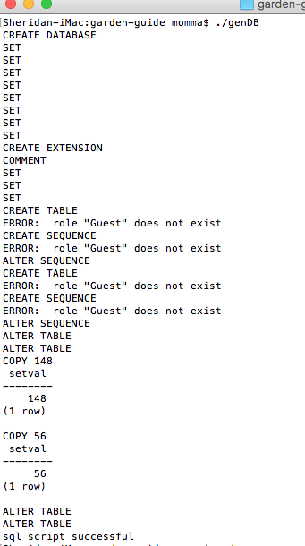

# Garden Guide

##### Epicodus Group Project Java

### By Rich Garrick, Carson Carnales, Jessica Sheridan, David Cuthell

## Description

Plan your vegetable planting season with the Garden Guide. Select a plant and see a wealth
of information including all planting Date Events and planting attributes
based on the data for the Portland OR area, USDA Zone 8b, from local gardener's
favorite Portland Nursery's Veggie Calendar.  

## Setup Requirements:

### Clone the repo: 
	* git clone https://github.com/jessicakenney/garden-guide.git
### Generate garden_guide DB (from a machine running Postgres):
	* In a terminal, cd to your garden-guide project-root dir
	* run genDB script. (This script requires $project-root/src/main/resources/db/garden_guide.sql in repo) 
		* $ ./genDB

#### Example:  

	* Run App.java and bring up url: localhost:4567 
	* Refer to API documentation in this README and at localhost:4567/api_documentation

## API Documentation
### Admin Post Endpoints
#### Endpoints:
	*localhost:4567/gardenguideapi/plants/new	--Add 1 or more Plant JSON 
	*localhost:4567/gardenguideapi/events/new	--Add 1 or more Event JSON 

### User Get Endpoints
#### Endpoints:
	*localhost:4567/gardenguideapi/plants		--Get All plants JSON in database
	*localhost:4567/gardenguideapi/:plantName	--Get individual plant data 
	
## Specifications

| Behavior      | Example Input         | Example Output        |
| ------------- | ------------- | ------------- |
|  User Selects a Plant | Click PlantName | Plant Detail Is Displayed |
|  User requests all API output | submit GET endpoint | All plant data is returned |
|  User requests specific API output | submit GET endpoint | specific plant data returned |

## Known Bugs
* "Rich Garrick" <richg341@gmail.com>

## Technologies Used
Java, Spark, Postman, Postgres, SQL

## Contributing

1. Fork it
2. Create your feature branch: `git checkout -b my-new-feature`
3. Commit your changes: `git commit -am 'Add some feature'`
4. Push to the branch: `git push origin my-new-feature`
5. Submit a pull request :D

## License
The MIT License (MIT)
Copyright 2017 Rich Garrick, Carson Carnales, Jessica Sheridan, David Cuthell

Permission is hereby granted, free of charge, to any person obtaining a copy of this software and associated documentation files (the "Software"), to deal in the Software without restriction, including without limitation the rights to use, copy, modify, merge, publish, distribute, sublicense, and/or sell copies of the Software, and to permit persons to whom the Software is furnished to do so, subject to the following conditions:

The above copyright notice and this permission notice shall be included in all copies or substantial portions of the Software.

THE SOFTWARE IS PROVIDED "AS IS", WITHOUT WARRANTY OF ANY KIND, EXPRESS OR IMPLIED, INCLUDING BUT NOT LIMITED TO THE WARRANTIES OF MERCHANTABILITY, FITNESS FOR A PARTICULAR PURPOSE AND NONINFRINGEMENT. IN NO EVENT SHALL THE AUTHORS OR COPYRIGHT HOLDERS BE LIABLE FOR ANY CLAIM, DAMAGES OR OTHER LIABILITY, WHETHER IN AN ACTION OF CONTRACT, TORT OR OTHERWISE, ARISING FROM, OUT OF OR IN CONNECTION WITH THE SOFTWARE OR THE USE OR OTHER DEALINGS IN THE SOFTWARE.
